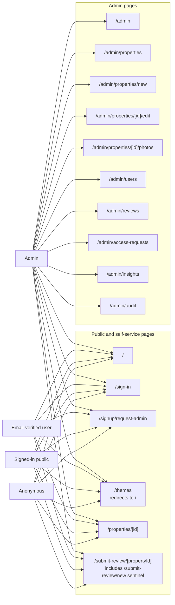
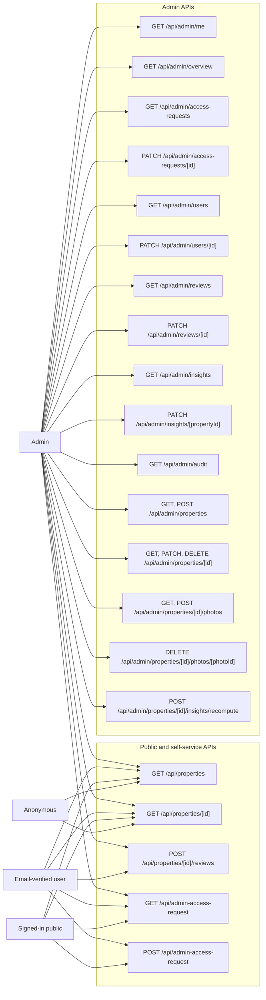

# Route Access Map

This file visualizes the routes currently exposed by the `livedin` web app and
which user types can reach them based on the route files and auth checks in the
codebase.

## User Types

- `Anonymous`: not signed in
- `Signed-in public`: signed in, not admin, email may be unverified
- `Email-verified user`: signed in with `profiles.email_verified = true`
- `Admin`: signed in with `profiles.role = 'admin'`

## Page Routes

### Page Matrix

| Route | Anonymous | Signed-in public | Email-verified user | Admin | Notes |
| --- | --- | --- | --- | --- | --- |
| `/` | Yes | Yes | Yes | Yes | Public property search |
| `/sign-in` | Yes | Yes | Yes | Yes | Existing session may redirect away |
| `/signup/request-admin` | Prompt only | Yes | Yes | Yes | Non-admin flow; admin sees already-has-access state |
| `/themes` | Yes | Yes | Yes | Yes | Immediate redirect to `/` |
| `/properties/[id]` | Yes | Yes | Yes | Yes | Only for active properties |
| `/submit-review/[propertyId]` | Page opens | Page opens | Yes | Yes | Submit action still requires verified email |
| `/admin` | Guarded UI only | Guarded UI only | Guarded UI only | Yes | Admin content protected client-side and by API |
| `/admin/properties` | Guarded UI only | Guarded UI only | Guarded UI only | Yes | Admin only |
| `/admin/properties/new` | Guarded UI only | Guarded UI only | Guarded UI only | Yes | Admin only |
| `/admin/properties/[id]/edit` | Guarded UI only | Guarded UI only | Guarded UI only | Yes | Admin only |
| `/admin/properties/[id]/photos` | Guarded UI only | Guarded UI only | Guarded UI only | Yes | Admin only |
| `/admin/users` | Guarded UI only | Guarded UI only | Guarded UI only | Yes | Admin only |
| `/admin/reviews` | Guarded UI only | Guarded UI only | Guarded UI only | Yes | Admin only |
| `/admin/access-requests` | Guarded UI only | Guarded UI only | Guarded UI only | Yes | Admin only |
| `/admin/insights` | Guarded UI only | Guarded UI only | Guarded UI only | Yes | Admin only |
| `/admin/audit` | Guarded UI only | Guarded UI only | Guarded UI only | Yes | Admin only |

## API Routes

### API Matrix

| Route | Anonymous | Signed-in public | Email-verified user | Admin | Notes |
| --- | --- | --- | --- | --- | --- |
| `GET /api/properties` | Yes | Yes | Yes | Yes | Public list of active properties |
| `GET /api/properties/[id]` | Yes | Yes | Yes | Yes | Public detail for active property |
| `POST /api/properties/[id]/reviews` | No | No | Yes | Yes | Requires valid token and `email_verified = true` |
| `GET /api/admin-access-request` | No | Yes | Yes | Yes | Requires signed-in account with profile |
| `POST /api/admin-access-request` | No | Eligible only | Eligible only | No | Non-admin only; bootstrap and allowlist rules apply |
| `GET /api/admin/me` | No | No | No | Yes | Admin only |
| `GET /api/admin/overview` | No | No | No | Yes | Admin only |
| `GET /api/admin/access-requests` | No | No | No | Yes | Admin only |
| `PATCH /api/admin/access-requests/[id]` | No | No | No | Yes | Admin only |
| `GET /api/admin/users` | No | No | No | Yes | Admin only |
| `PATCH /api/admin/users/[id]` | No | No | No | Yes | Admin only |
| `GET /api/admin/reviews` | No | No | No | Yes | Admin only |
| `PATCH /api/admin/reviews/[id]` | No | No | No | Yes | Admin only |
| `GET /api/admin/insights` | No | No | No | Yes | Admin only |
| `PATCH /api/admin/insights/[propertyId]` | No | No | No | Yes | Admin only |
| `GET /api/admin/audit` | No | No | No | Yes | Admin only |
| `GET /api/admin/properties` | No | No | No | Yes | Admin only |
| `POST /api/admin/properties` | No | No | No | Yes | Admin only |
| `GET /api/admin/properties/[id]` | No | No | No | Yes | Admin only |
| `PATCH /api/admin/properties/[id]` | No | No | No | Yes | Admin only |
| `DELETE /api/admin/properties/[id]` | No | No | No | Yes | Admin only |
| `GET /api/admin/properties/[id]/photos` | No | No | No | Yes | Admin only |
| `POST /api/admin/properties/[id]/photos` | No | No | No | Yes | Admin only |
| `DELETE /api/admin/properties/[id]/photos/[photoId]` | No | No | No | Yes | Admin only |
| `POST /api/admin/properties/[id]/insights/recompute` | No | No | No | Yes | Admin only |

## Important Notes

- `/admin/*` does not use server middleware. The page guard is implemented in the
  admin layout, and privileged data is enforced by the `/api/admin/*` handlers.
- `/submit-review/new` is not its own page file. It is handled by the dynamic
  route `/submit-review/[propertyId]` and treated as a special sentinel value in
  the review flow UI.
- The review submission API checks `profiles.email_verified`, not
  `profiles.role === 'verified'`.
- The admin-request flow includes extra states beyond role alone:
  `eligible`, `pending`, `rejected`, `approved`, and first-admin bootstrap.
