> **Merged Document** — The content of this document has been merged into the canonical `proj_docs/Schema & ERD.md`. This file is retained for reference but `Schema & ERD.md` is the authoritative schema document going forward.

# Database Schema Architecture — PRD v2

> **Status:** Design only — not implemented  
> **Date:** April 8, 2026  
> **Purpose:** Document how the database evolves from the current LivedIn schema to support the full two-sided marketplace (Consumer UX + Business Portal) described in PRD v2.

---

## Current Schema (Baseline)

The existing database has **8 tables** serving the core renter review platform:

| Table | Purpose |
|---|---|
| `profiles` | User accounts (roles: `public`, `verified`, `admin`) |
| `properties` | Rental property listings |
| `reviews` | Structured 5-metric reviews (0–5, half-star) |
| `property_aggregates` | Precomputed average scores per property |
| `distilled_insights` | AI-generated review summaries per property |
| `property_photos` | R2-hosted photo metadata |
| `admin_audit_log` | Admin action history |
| `admin_role_requests` | Requests for admin role promotion |
| `admin_bootstrap_allowlist` | Bootstrap admin email allowlist |

---

## PRD v2 Schema Evolution

To support the **two-sided marketplace** (renter UX + landlord Business Portal), the schema needs **8 new tables**, **2 altered tables**, and several new RLS policies, views, and functions. All changes are **additive** — no destructive modifications to existing tables.

---

## Altered Tables

### 1. `profiles` — Add `landlord` role

**Change:** Add `'landlord'` to the role check constraint.

```sql
-- Current CHECK: role IN ('public', 'verified', 'admin')
-- New CHECK:     role IN ('public', 'verified', 'admin', 'landlord')
```

No columns added. The `landlord` role gates access to the Business Portal and scopes all portal queries to the user's portfolio.

### 2. `properties` — Add neighbourhood link

**New column:**

| Column | Type | Constraints |
|---|---|---|
| `neighbourhood_id` | `uuid` | nullable, FK → `neighbourhoods(id)` ON DELETE SET NULL |

---

## New Tables

### 1. `neighbourhoods`

Supports FR-CX-01 (Neighbourhood Browsing) and FR-BP-05 (Benchmark Comparison).

| Column | Type | Constraints |
|---|---|---|
| `id` | `uuid` | PK, default `gen_random_uuid()` |
| `name` | `text` | NOT NULL, UNIQUE per city |
| `city` | `text` | NOT NULL |
| `province` | `text` | NOT NULL |
| `description` | `text` | nullable |
| `property_count` | `integer` | NOT NULL default 0 |
| `avg_trust_score` | `numeric(3,2)` | nullable (0.00–5.00) |
| `created_at` | `timestamptz` | NOT NULL default now() |
| `updated_at` | `timestamptz` | NOT NULL default now() |

### 2. `user_shortlists`

Supports FR-CX-04 (Renter Dashboard shortlisted properties).

| Column | Type | Constraints |
|---|---|---|
| `id` | `uuid` | PK, default `gen_random_uuid()` |
| `user_id` | `uuid` | NOT NULL, FK → `profiles(user_id)` ON DELETE CASCADE |
| `property_id` | `uuid` | NOT NULL, FK → `properties(id)` ON DELETE CASCADE |
| `created_at` | `timestamptz` | NOT NULL default now() |

**Constraints:** `UNIQUE (user_id, property_id)`

### 3. `portfolio_properties`

Links landlord accounts to the properties they manage. Supports all Business Portal features (FR-BP-01 through FR-BP-07). This is the **central pivot table** for the entire Business Portal — every portal query is scoped through it.

| Column | Type | Constraints |
|---|---|---|
| `id` | `uuid` | PK, default `gen_random_uuid()` |
| `user_id` | `uuid` | NOT NULL, FK → `profiles(user_id)` ON DELETE CASCADE |
| `property_id` | `uuid` | NOT NULL, FK → `properties(id)` ON DELETE CASCADE |
| `added_at` | `timestamptz` | NOT NULL default now() |

**Constraints:** `UNIQUE (user_id, property_id)` — a property can belong to multiple landlord portfolios (e.g., owner + property manager), but each link is unique.

### 4. `team_members`

Supports FR-BP-08 (Team Access Management). Allows a landlord to delegate portal access to other users with role-based permissions.

| Column | Type | Constraints |
|---|---|---|
| `id` | `uuid` | PK, default `gen_random_uuid()` |
| `owner_user_id` | `uuid` | NOT NULL, FK → `profiles(user_id)` ON DELETE CASCADE |
| `member_user_id` | `uuid` | NOT NULL, FK → `profiles(user_id)` ON DELETE CASCADE |
| `role` | `text` | NOT NULL, CHECK IN ('viewer', 'editor', 'admin'), default 'viewer' |
| `invited_email` | `text` | NOT NULL |
| `accepted_at` | `timestamptz` | nullable (NULL = pending invite) |
| `created_at` | `timestamptz` | NOT NULL default now() |
| `updated_at` | `timestamptz` | NOT NULL default now() |

**Constraints:** `UNIQUE (owner_user_id, member_user_id)`, CHECK `owner_user_id != member_user_id`

**Semantics:**
- `owner_user_id` — the landlord who owns the portfolio
- `member_user_id` — the team member who inherits portfolio-scoped access
- **viewer** — read-only access to portfolio data
- **editor** — can draft review responses, manage company profile
- **admin** — full access including team management

### 5. `notification_preferences`

Supports FR-BP-10 (Notification Preferences).

| Column | Type | Constraints |
|---|---|---|
| `user_id` | `uuid` | PK, FK → `profiles(user_id)` ON DELETE CASCADE |
| `new_review_alert` | `boolean` | NOT NULL default true |
| `review_response_approved` | `boolean` | NOT NULL default true |
| `weekly_summary` | `boolean` | NOT NULL default false |
| `review_gap_alert` | `boolean` | NOT NULL default true |
| `team_activity_alert` | `boolean` | NOT NULL default true |
| `updated_at` | `timestamptz` | NOT NULL default now() |

### 6. `review_response_drafts`

Supports FR-BP-02/FR-BP-03 (Review Feed + Moderation Queue). Landlords draft responses to reviews; admins approve/reject before publication.

| Column | Type | Constraints |
|---|---|---|
| `id` | `uuid` | PK, default `gen_random_uuid()` |
| `review_id` | `uuid` | NOT NULL, FK → `reviews(id)` ON DELETE CASCADE |
| `author_user_id` | `uuid` | NOT NULL, FK → `profiles(user_id)` ON DELETE CASCADE |
| `body` | `text` | NOT NULL, CHECK length <= 1000 |
| `status` | `text` | NOT NULL default 'pending', CHECK IN ('pending', 'approved', 'rejected') |
| `reviewed_by` | `uuid` | nullable, FK → `profiles(user_id)` ON DELETE SET NULL |
| `reviewed_at` | `timestamptz` | nullable |
| `created_at` | `timestamptz` | NOT NULL default now() |
| `updated_at` | `timestamptz` | NOT NULL default now() |

**Constraints:** Only one approved response per review: partial unique index `UNIQUE (review_id) WHERE status = 'approved'`

### 7. `benchmark_averages`

Supports FR-BP-05 (Benchmark Comparison). Stores precomputed city/neighbourhood aggregate baselines.

| Column | Type | Constraints |
|---|---|---|
| `id` | `uuid` | PK, default `gen_random_uuid()` |
| `scope_type` | `text` | NOT NULL, CHECK IN ('city', 'neighbourhood') |
| `scope_value` | `text` | NOT NULL (city name or neighbourhood name) |
| `neighbourhood_id` | `uuid` | nullable, FK → `neighbourhoods(id)` ON DELETE CASCADE |
| `avg_management_responsiveness` | `numeric(3,2)` | nullable |
| `avg_maintenance_timeliness` | `numeric(3,2)` | nullable |
| `avg_listing_accuracy` | `numeric(3,2)` | nullable |
| `avg_fee_transparency` | `numeric(3,2)` | nullable |
| `avg_lease_clarity` | `numeric(3,2)` | nullable |
| `avg_trust_score` | `numeric(3,2)` | nullable |
| `property_count` | `integer` | NOT NULL default 0 |
| `review_count` | `integer` | NOT NULL default 0 |
| `computed_at` | `timestamptz` | NOT NULL default now() |

**Constraints:** `UNIQUE (scope_type, scope_value)`

### 8. `company_profiles`

Supports FR-BP-09 (Company Profile). Public-facing landlord/management company profile.

| Column | Type | Constraints |
|---|---|---|
| `user_id` | `uuid` | PK, FK → `profiles(user_id)` ON DELETE CASCADE |
| `company_name` | `text` | NOT NULL |
| `description` | `text` | nullable, CHECK length <= 2000 |
| `website_url` | `text` | nullable |
| `contact_email` | `text` | nullable |
| `contact_phone` | `text` | nullable |
| `logo_r2_key` | `text` | nullable |
| `created_at` | `timestamptz` | NOT NULL default now() |
| `updated_at` | `timestamptz` | NOT NULL default now() |

---

## Entity-Relationship Diagram

```mermaid
erDiagram
    AUTH_USERS {
        uuid id PK
    }

    PROFILES {
        uuid user_id PK, FK
        text role "public | verified | admin | landlord"
        boolean email_verified
        text theme_key
        timestamptz created_at
        timestamptz updated_at
    }

    NEIGHBOURHOODS {
        uuid id PK
        text name
        text city
        text province
        text description
        integer property_count
        numeric avg_trust_score
        timestamptz created_at
        timestamptz updated_at
    }

    PROPERTIES {
        uuid id PK
        text display_name
        text address_line1
        text address_line2
        text city
        text province
        text postal_code
        text management_company
        text status "active | inactive"
        uuid created_by FK
        uuid neighbourhood_id FK "NEW"
        timestamptz created_at
        timestamptz updated_at
    }

    REVIEWS {
        uuid id PK
        uuid property_id FK
        uuid user_id FK
        text status "pending | approved | rejected | removed"
        numeric management_responsiveness "0-5 half-star"
        numeric maintenance_timeliness
        numeric listing_accuracy
        numeric fee_transparency
        numeric lease_clarity
        text text_input "max 500 chars"
        date tenancy_start
        date tenancy_end
        timestamptz created_at
        timestamptz updated_at
    }

    PROPERTY_AGGREGATES {
        uuid property_id PK, FK
        integer review_count
        numeric avg_management_responsiveness
        numeric avg_maintenance_timeliness
        numeric avg_listing_accuracy
        numeric avg_fee_transparency
        numeric avg_lease_clarity
        numeric avg_trustscore
        smallint display_management_responsiveness_0_5
        smallint display_maintenance_timeliness_0_5
        smallint display_listing_accuracy_0_5
        smallint display_fee_transparency_0_5
        smallint display_lease_clarity_0_5
        smallint display_trustscore_0_5
        timestamptz last_updated
    }

    DISTILLED_INSIGHTS {
        uuid property_id PK, FK
        text insights_text
        text status "pending | approved | rejected | hidden"
        boolean screened
        jsonb screening_flags
        timestamptz last_generated_at
        timestamptz screened_at
        timestamptz updated_at
    }

    PROPERTY_PHOTOS {
        uuid id PK
        uuid property_id FK
        text r2_bucket
        text r2_key
        text content_type
        bigint bytes
        integer width
        integer height
        uuid uploaded_by FK
        timestamptz created_at
    }

    ADMIN_AUDIT_LOG {
        uuid id PK
        uuid admin_user_id FK
        text action_type
        text target_type
        uuid target_id
        jsonb details
        timestamptz created_at
    }

    ADMIN_ROLE_REQUESTS {
        uuid id PK
        uuid user_id FK
        text email_snapshot
        text reason
        text status "pending | approved | rejected"
        uuid reviewed_by FK
        timestamptz reviewed_at
        timestamptz created_at
        timestamptz updated_at
    }

    ADMIN_BOOTSTRAP_ALLOWLIST {
        text email PK
        timestamptz created_at
    }

    USER_SHORTLISTS {
        uuid id PK
        uuid user_id FK
        uuid property_id FK
        timestamptz created_at
    }

    PORTFOLIO_PROPERTIES {
        uuid id PK
        uuid user_id FK
        uuid property_id FK
        timestamptz added_at
    }

    TEAM_MEMBERS {
        uuid id PK
        uuid owner_user_id FK
        uuid member_user_id FK
        text role "viewer | editor | admin"
        text invited_email
        timestamptz accepted_at
        timestamptz created_at
        timestamptz updated_at
    }

    NOTIFICATION_PREFERENCES {
        uuid user_id PK, FK
        boolean new_review_alert
        boolean review_response_approved
        boolean weekly_summary
        boolean review_gap_alert
        boolean team_activity_alert
        timestamptz updated_at
    }

    REVIEW_RESPONSE_DRAFTS {
        uuid id PK
        uuid review_id FK
        uuid author_user_id FK
        text body "max 1000 chars"
        text status "pending | approved | rejected"
        uuid reviewed_by FK
        timestamptz reviewed_at
        timestamptz created_at
        timestamptz updated_at
    }

    BENCHMARK_AVERAGES {
        uuid id PK
        text scope_type "city | neighbourhood"
        text scope_value
        uuid neighbourhood_id FK
        numeric avg_management_responsiveness
        numeric avg_maintenance_timeliness
        numeric avg_listing_accuracy
        numeric avg_fee_transparency
        numeric avg_lease_clarity
        numeric avg_trust_score
        integer property_count
        integer review_count
        timestamptz computed_at
    }

    COMPANY_PROFILES {
        uuid user_id PK, FK
        text company_name
        text description "max 2000 chars"
        text website_url
        text contact_email
        text contact_phone
        text logo_r2_key
        timestamptz created_at
        timestamptz updated_at
    }

    %% === RELATIONSHIPS ===

    AUTH_USERS ||--|| PROFILES : "1:1 sync"

    PROFILES ||--o{ REVIEWS : "user_id"
    PROFILES ||--o{ USER_SHORTLISTS : "user_id"
    PROFILES ||--o{ PORTFOLIO_PROPERTIES : "user_id (landlord)"
    PROFILES ||--o{ TEAM_MEMBERS : "owner_user_id"
    PROFILES ||--o{ TEAM_MEMBERS : "member_user_id"
    PROFILES ||--o| NOTIFICATION_PREFERENCES : "user_id"
    PROFILES ||--o| COMPANY_PROFILES : "user_id"
    PROFILES ||--o{ REVIEW_RESPONSE_DRAFTS : "author_user_id"
    PROFILES ||--o{ ADMIN_AUDIT_LOG : "admin_user_id"
    PROFILES ||--o{ ADMIN_ROLE_REQUESTS : "user_id"
    PROFILES ||--o{ PROPERTIES : "created_by"
    PROFILES ||--o{ PROPERTY_PHOTOS : "uploaded_by"

    NEIGHBOURHOODS ||--o{ PROPERTIES : "neighbourhood_id"
    NEIGHBOURHOODS ||--o{ BENCHMARK_AVERAGES : "neighbourhood_id"

    PROPERTIES ||--o{ REVIEWS : "property_id"
    PROPERTIES ||--|| PROPERTY_AGGREGATES : "property_id"
    PROPERTIES ||--o| DISTILLED_INSIGHTS : "property_id"
    PROPERTIES ||--o{ PROPERTY_PHOTOS : "property_id"
    PROPERTIES ||--o{ USER_SHORTLISTS : "property_id"
    PROPERTIES ||--o{ PORTFOLIO_PROPERTIES : "property_id"

    REVIEWS ||--o{ REVIEW_RESPONSE_DRAFTS : "review_id"
```



---

## RLS Policy Design (New Tables)

### `neighbourhoods`

| Policy | Operation | Rule |
|---|---|---|
| `neighbourhoods_select_public` | SELECT | Everyone (no auth required) |
| `neighbourhoods_insert_admin` | INSERT | `is_admin()` |
| `neighbourhoods_update_admin` | UPDATE | `is_admin()` |
| `neighbourhoods_delete_admin` | DELETE | `is_admin()` |

### `user_shortlists`

| Policy | Operation | Rule |
|---|---|---|
| `shortlists_select_own` | SELECT | `auth.uid() = user_id` |
| `shortlists_insert_own` | INSERT | `auth.uid() = user_id` AND `is_verified()` |
| `shortlists_delete_own` | DELETE | `auth.uid() = user_id` |
| `shortlists_select_admin` | SELECT | `is_admin()` |

### `portfolio_properties`

| Policy | Operation | Rule |
|---|---|---|
| `portfolio_select_own` | SELECT | `auth.uid() = user_id` OR user is a team member of the owner |
| `portfolio_insert_admin` | INSERT | `is_admin()` (admins assign properties to landlord portfolios) |
| `portfolio_delete_admin` | DELETE | `is_admin()` |
| `portfolio_select_admin` | SELECT | `is_admin()` |

### `team_members`

| Policy | Operation | Rule |
|---|---|---|
| `team_select_own` | SELECT | `auth.uid() = owner_user_id` OR `auth.uid() = member_user_id` |
| `team_insert_owner` | INSERT | `auth.uid() = owner_user_id` AND role = 'landlord' |
| `team_update_owner` | UPDATE | `auth.uid() = owner_user_id` |
| `team_delete_owner` | DELETE | `auth.uid() = owner_user_id` |
| `team_crud_admin` | ALL | `is_admin()` |

### `notification_preferences`

| Policy | Operation | Rule |
|---|---|---|
| `notif_select_own` | SELECT | `auth.uid() = user_id` |
| `notif_upsert_own` | INSERT/UPDATE | `auth.uid() = user_id` |

### `review_response_drafts`

| Policy | Operation | Rule |
|---|---|---|
| `response_insert_landlord` | INSERT | Author is landlord AND review's property is in their portfolio |
| `response_select_own` | SELECT | `auth.uid() = author_user_id` |
| `response_select_public_approved` | SELECT | `status = 'approved'` (anyone can read approved responses) |
| `response_update_admin` | UPDATE | `is_admin()` (for approval/rejection) |
| `response_select_admin` | SELECT | `is_admin()` |

### `benchmark_averages`

| Policy | Operation | Rule |
|---|---|---|
| `benchmarks_select_public` | SELECT | Everyone |
| `benchmarks_crud_admin` | ALL | `is_admin()` |

### `company_profiles`

| Policy | Operation | Rule |
|---|---|---|
| `company_select_public` | SELECT | Everyone (public-facing) |
| `company_upsert_own` | INSERT/UPDATE | `auth.uid() = user_id` AND role = 'landlord' |
| `company_select_admin` | SELECT | `is_admin()` |

---

## New Helper Functions

| Function | Purpose |
|---|---|
| `is_landlord()` | SECURITY DEFINER; returns true if `profiles.role = 'landlord'` for `auth.uid()` |
| `is_portfolio_member(property_uuid)` | Returns true if the caller owns the property via `portfolio_properties` or is a team member of someone who does |
| `recompute_neighbourhood_aggregates(neighbourhood_uuid)` | Recomputes `property_count` and `avg_trust_score` for a neighbourhood from its linked properties |
| `recompute_benchmark_averages(scope_type, scope_value)` | Recomputes city or neighbourhood benchmark row from all approved reviews in that scope |

---

## New Views (Convenience)

| View | Purpose |
|---|---|
| `v_portfolio_overview` | Joins `portfolio_properties` → `properties` → `property_aggregates` for the portal dashboard |
| `v_neighbourhood_browse` | Joins `neighbourhoods` with property counts and average scores for the public neighbourhood listing |
| `v_review_with_response` | Joins `reviews` with their approved `review_response_drafts` for public display |

---

## Summary of Changes

| Category | Count | Details |
|---|---|---|
| New tables | **8** | `neighbourhoods`, `user_shortlists`, `portfolio_properties`, `team_members`, `notification_preferences`, `review_response_drafts`, `benchmark_averages`, `company_profiles` |
| Altered tables | **2** | `profiles` (role constraint), `properties` (+ `neighbourhood_id` FK) |
| New RLS policies | **~25** | Portfolio-scoped reads for landlords, team member inheritance, public reads for benchmarks/neighbourhoods/company profiles |
| New functions | **4** | `is_landlord()`, `is_portfolio_member()`, `recompute_neighbourhood_aggregates()`, `recompute_benchmark_averages()` |
| New views | **3** | `v_portfolio_overview`, `v_neighbourhood_browse`, `v_review_with_response` |
| Destructive changes | **0** | All additive — no existing tables, columns, RLS, triggers, or functions are modified or dropped |

---

## Key Architectural Principle

`portfolio_properties` is the **pivot table** that connects landlords to properties. Every Business Portal query is scoped through this table — a landlord can only see properties, reviews, aggregates, and insights for properties that appear in their portfolio. Team members inherit this scope through `team_members.owner_user_id`.
