# Schema & ERD — Authoritative Reference

> **Purpose:** Single reference for the Team Renter / LivedIn database: the **baseline schema** (original Schema & ERD specification, aligned with Supabase migrations) and **PRD v2 evolution** (design — not all items implemented yet).  
> **Sources:** Schema & ERD PDF (referenced in project slice index), `proj_docs/DB Schema Architecture - PRDv2.md`, and `supabase/migrations/`.

---

## PART 1: Current Schema (Baseline)

This section reflects the **original Schema & ERD** contract: renter review core, moderation support tables, R2 photo metadata, admin audit trail, and later admin-access workflow tables.

### Global notes

- **`auth.users`:** Supabase auth identities. `public.profiles.user_id` is the application profile PK/FK to `auth.users(id)` (typically `ON DELETE CASCADE`).
- **`set_updated_at()`:** Shared `BEFORE UPDATE` trigger function that sets `NEW.updated_at := now()`.
- **`property_aggregates` display scale:** The PDF-era schema used `display_*_0_6` (0–6 display mapping from 0–5 averages). **Production evolved** to `display_*_0_5` with CHECK `0..5` and updated `recompute_property_aggregates` logic (see migration `20260311123000_scale_public_scores_to_5.sql`). Treat **0–5** as the current display contract unless you are reading historical docs.

---

### 1. `profiles`

**Purpose:** Application user row aligned 1:1 with `auth.users`; stores role, verification, and preferences.

| Column | Type | Constraints |
|--------|------|-------------|
| `user_id` | `uuid` | PK, FK → `auth.users(id)` ON DELETE CASCADE |
| `role` | `text` | NOT NULL, default `'public'`, CHECK IN (`'public'`, `'verified'`, `'admin'`) |
| `email_verified` | `boolean` | NOT NULL, default `false` |
| `created_at` | `timestamptz` | NOT NULL, default `now()` |
| `updated_at` | `timestamptz` | NOT NULL, default `now()` |
| `theme_key` | `text` | NOT NULL, default `'recommended'` — **added in implementation** (allowed values enforced via CHECK; see `20260311170000_add_profile_theme_preference.sql`) |

**Indexes:** Primary key on `user_id` only (no extra btree indexes in baseline migrations).

**Triggers:**

| Trigger | Event | Function |
|---------|--------|----------|
| `profiles_set_updated_at` | BEFORE UPDATE | `set_updated_at()` |
| `profiles_restrict_sensitive_update` | BEFORE UPDATE | Restricts non-admin updates to sensitive columns (RLS-related; Slice 05) |

---

### 2. `properties`

**Purpose:** Rental property records shown on the public site and used as the anchor for reviews, aggregates, and photos.

| Column | Type | Constraints |
|--------|------|-------------|
| `id` | `uuid` | PK, default `gen_random_uuid()` |
| `display_name` | `text` | NOT NULL |
| `address_line1` | `text` | NOT NULL |
| `address_line2` | `text` | nullable |
| `city` | `text` | NOT NULL |
| `province` | `text` | NOT NULL |
| `postal_code` | `text` | NOT NULL |
| `management_company` | `text` | nullable |
| `status` | `text` | NOT NULL, default `'active'`, CHECK IN (`'active'`, `'inactive'`) |
| `created_by` | `uuid` | FK → `profiles(user_id)` ON DELETE SET NULL |
| `created_at` | `timestamptz` | NOT NULL, default `now()` |
| `updated_at` | `timestamptz` | NOT NULL, default `now()` |

**Indexes:** PK only in baseline slice.

**Triggers:**

| Trigger | Event | Function |
|---------|--------|----------|
| `properties_set_updated_at` | BEFORE UPDATE | `set_updated_at()` |

---

### 3. `reviews`

**Purpose:** Structured five-metric reviews per user per property; drives `property_aggregates` via trigger when `status = 'approved'`.

| Column | Type | Constraints |
|--------|------|-------------|
| `id` | `uuid` | PK, default `gen_random_uuid()` |
| `property_id` | `uuid` | NOT NULL, FK → `properties(id)` ON DELETE CASCADE |
| `user_id` | `uuid` | NOT NULL, FK → `profiles(user_id)` ON DELETE CASCADE |
| `status` | `text` | NOT NULL, default `'pending'`, CHECK IN (`'pending'`, `'approved'`, `'rejected'`, `'removed'`) |
| `management_responsiveness` | `smallint` | NOT NULL, CHECK 0–5 |
| `maintenance_timeliness` | `smallint` | NOT NULL, CHECK 0–5 |
| `listing_accuracy` | `smallint` | NOT NULL, CHECK 0–5 |
| `fee_transparency` | `smallint` | NOT NULL, CHECK 0–5 |
| `lease_clarity` | `smallint` | NOT NULL, CHECK 0–5 |
| `text_input` | `text` | nullable, CHECK `char_length(text_input) <= 500` when not null |
| `tenancy_start` | `date` | nullable |
| `tenancy_end` | `date` | nullable |
| `created_at` | `timestamptz` | NOT NULL, default `now()` |
| `updated_at` | `timestamptz` | NOT NULL, default `now()` |
| — | — | UNIQUE (`user_id`, `property_id`) |
| — | — | CHECK `tenancy_start <= tenancy_end` when both set |

**Indexes:**

| Index | Columns |
|-------|---------|
| `idx_reviews_property` | `property_id` |
| `idx_reviews_user` | `user_id` |
| `idx_reviews_status` | `status` |
| `idx_reviews_created_at` | `created_at` |

**Triggers:**

| Trigger | Event | Function |
|---------|--------|----------|
| `reviews_set_updated_at` | BEFORE UPDATE | `set_updated_at()` |
| `reviews_enforce_rate_limit` | BEFORE INSERT | `enforce_review_rate_limit()` |
| `reviews_aggregate_insert` | AFTER INSERT | `reviews_aggregate_trigger()` |
| `reviews_aggregate_update` | AFTER UPDATE | `reviews_aggregate_trigger()` |
| `reviews_aggregate_delete` | AFTER DELETE | `reviews_aggregate_trigger()` |

---

### 4. `property_aggregates`

**Purpose:** Precomputed counts and averages from **approved** reviews only; public-facing display integers for UI.

| Column | Type | Constraints |
|--------|------|-------------|
| `property_id` | `uuid` | PK, FK → `properties(id)` ON DELETE CASCADE |
| `review_count` | `int` | NOT NULL, default 0 |
| `avg_management_responsiveness` | `numeric` | nullable |
| `avg_maintenance_timeliness` | `numeric` | nullable |
| `avg_listing_accuracy` | `numeric` | nullable |
| `avg_fee_transparency` | `numeric` | nullable |
| `avg_lease_clarity` | `numeric` | nullable |
| `avg_trustscore` | `numeric` | nullable (mean of the five metric averages) |
| `display_*` | `smallint` | Per-metric + trust; **PDF:** `display_*_0_6` (0–6). **Current:** `display_*_0_5` (0–5) after scale migration |
| `last_updated` | `timestamptz` | NOT NULL, default `now()` |

**Indexes:**

| Index | Columns |
|-------|---------|
| `idx_property_aggregates_review_count` | `review_count` |

**Triggers:** None directly; rows are maintained by `recompute_property_aggregates` from review triggers.

---

### 5. `distilled_insights`

**Purpose:** AI-generated (or pipeline-generated) textual summary per property with moderation and screening metadata.

| Column | Type | Constraints |
|--------|------|-------------|
| `property_id` | `uuid` | PK, FK → `properties(id)` ON DELETE CASCADE |
| `insights_text` | `text` | NOT NULL |
| `status` | `text` | NOT NULL, default `'pending'`, CHECK IN (`'pending'`, `'approved'`, `'rejected'`, `'hidden'`) |
| `screened` | `boolean` | NOT NULL, default `false` |
| `screening_flags` | `jsonb` | nullable |
| `last_generated_at` | `timestamptz` | NOT NULL, default `now()` |
| `screened_at` | `timestamptz` | nullable |
| `updated_at` | `timestamptz` | NOT NULL, default `now()` |

**Indexes:**

| Index | Columns |
|-------|---------|
| `idx_insights_status` | `status` |

**Triggers:**

| Trigger | Event | Function |
|---------|--------|----------|
| `distilled_insights_set_updated_at` | BEFORE UPDATE | `set_updated_at()` |

---

### 6. `property_photos`

**Purpose:** Metadata for images stored in Cloudflare R2 (bucket + key); optional `content_type`, size, dimensions.

| Column | Type | Constraints |
|--------|------|-------------|
| `id` | `uuid` | PK, default `gen_random_uuid()` |
| `property_id` | `uuid` | NOT NULL, FK → `properties(id)` ON DELETE CASCADE |
| `r2_bucket` | `text` | NOT NULL |
| `r2_key` | `text` | NOT NULL |
| `content_type` | `text` | nullable |
| `bytes` | `bigint` | nullable |
| `width` | `int` | nullable |
| `height` | `int` | nullable |
| `uploaded_by` | `uuid` | FK → `profiles(user_id)` ON DELETE SET NULL |
| `created_at` | `timestamptz` | NOT NULL, default `now()` |
| — | — | UNIQUE (`r2_bucket`, `r2_key`) |

**Indexes:** PK + unique constraint on (`r2_bucket`, `r2_key`); no extra btree in slice 04.

**Triggers:** None in baseline schema migration.

---

### 7. `admin_audit_log`

**Purpose:** Append-only style log of admin actions for accountability.

| Column | Type | Constraints |
|--------|------|-------------|
| `id` | `uuid` | PK, default `gen_random_uuid()` |
| `admin_user_id` | `uuid` | NOT NULL, FK → `profiles(user_id)` ON DELETE CASCADE |
| `action_type` | `text` | NOT NULL |
| `target_type` | `text` | NOT NULL |
| `target_id` | `uuid` | nullable |
| `details` | `jsonb` | nullable |
| `created_at` | `timestamptz` | NOT NULL, default `now()` |

**Indexes / triggers:** None in slice 04 beyond PK.

---

### 8. `content_reports`

**Purpose:** User or anonymous reports against platform content (reviews, properties, etc.) for moderation triage.

| Column | Type | Constraints |
|--------|------|-------------|
| `id` | `uuid` | PK |
| `reporter_user_id` | `uuid` | nullable, FK → `profiles(user_id)` |
| `target_type` | `text` | NOT NULL, CHECK (domain-specific allowed values per product spec) |
| `target_id` | `uuid` | NOT NULL |
| `reason` | `text` | NOT NULL |
| `status` | `text` | NOT NULL, CHECK (workflow states per product spec) |
| `created_at` | `timestamptz` | NOT NULL, default `now()` |

**Indexes / triggers:** Define when implementing (e.g. `(status, created_at)`, `(target_type, target_id)`). *Not present in early `supabase/migrations` slice 04; add when moderation reporting ships.*

---

### 9. `moderation_events`

**Purpose:** History of moderation state transitions on arbitrary targets (reviews, insights, reports, etc.).

| Column | Type | Constraints |
|--------|------|-------------|
| `id` | `uuid` | PK |
| `admin_user_id` | `uuid` | NOT NULL, FK → `profiles(user_id)` |
| `target_type` | `text` | NOT NULL |
| `target_id` | `uuid` | NOT NULL |
| `from_status` | `text` | nullable |
| `to_status` | `text` | NOT NULL |
| `notes` | `text` | nullable |
| `created_at` | `timestamptz` | NOT NULL, default `now()` |

**Indexes / triggers:** Define when implementing (e.g. `(target_type, target_id, created_at DESC)`). *Same note as `content_reports`.*

---

### 10. `admin_role_requests`

**Purpose:** Self-serve requests for promotion to `admin`; reviewed by existing admins with audit alignment.

**Core columns (Schema & ERD):**

| Column | Type | Constraints |
|--------|------|-------------|
| `id` | `uuid` | PK, default `gen_random_uuid()` |
| `user_id` | `uuid` | NOT NULL, FK → `profiles(user_id)` ON DELETE CASCADE |
| `email_snapshot` | `text` | NOT NULL |
| `reason` | `text` | NOT NULL (implementation: length checks) |
| `status` | `text` | NOT NULL, default `'pending'`, CHECK IN (`'pending'`, `'approved'`, `'rejected'`) |
| `reviewed_by` | `uuid` | nullable, FK → `profiles(user_id)` ON DELETE SET NULL |
| `reviewed_at` | `timestamptz` | nullable |
| `created_at` | `timestamptz` | NOT NULL, default `now()` |
| `updated_at` | `timestamptz` | NOT NULL, default `now()` |

**Implementation extensions (migrations):** e.g. `team_context`, `review_notes`, review state consistency CHECK, partial unique index **one pending request per user**.

**Indexes (typical):**

| Index | Definition |
|-------|------------|
| `admin_role_requests_one_pending_per_user` | UNIQUE (`user_id`) WHERE `status = 'pending'` |
| `idx_admin_role_requests_status_created_at` | (`status`, `created_at` DESC) |
| `idx_admin_role_requests_user_created_at` | (`user_id`, `created_at` DESC) |

**Triggers:**

| Trigger | Event | Function |
|---------|--------|----------|
| `admin_role_requests_set_updated_at` | BEFORE UPDATE | `set_updated_at()` |

---

### 11. `admin_bootstrap_allowlist`

**Purpose:** Seed list of emails allowed to claim the first admin account(s) in a fresh environment.

| Column | Type | Constraints |
|--------|------|-------------|
| `email` | `text` | PK, normalized (lowercase/trim CHECKs in migration) |
| `created_at` | `timestamptz` | NOT NULL, default `now()` |

**Indexes:** Primary key on `email`.

**Triggers:** None in baseline migration.

---

### Baseline functions

| Function | Purpose |
|----------|---------|
| `set_updated_at()` | Trigger helper: sets `NEW.updated_at` on row update. |
| `enforce_review_rate_limit()` | **BEFORE INSERT** on `reviews`: raises if the user already has ≥ 3 rows in `reviews` with `created_at >= now() - interval '6 months'`. |
| `recompute_property_aggregates(p_property_id uuid)` | Re-reads approved reviews for a property; upserts `property_aggregates` (averages, trust score, display columns, `last_updated`). Logic updated when display scale moved 0–6 → 0–5. |
| `reviews_aggregate_trigger()` | **AFTER** INSERT/UPDATE/DELETE on `reviews`: calls `recompute_property_aggregates` for affected `property_id`(s) when approval state or property linkage changes. |

---

## PART 2: PRD v2 Schema Evolution

> **Status:** Design documented in `DB Schema Architecture - PRDv2.md` — **not fully implemented** in production migrations at the time of this merge. Use Part 1 + migrations for “what exists today”; use Part 2 for planned marketplace features (Consumer UX + Business Portal).

### Altered tables

#### 1. `profiles` — add `landlord` role

**Change:** Extend the role CHECK constraint.

```sql
-- Current CHECK: role IN ('public', 'verified', 'admin')
-- New CHECK:     role IN ('public', 'verified', 'admin', 'landlord')
```

No new columns. `landlord` gates Business Portal access and portfolio-scoped queries.

#### 2. `properties` — neighbourhood link

| Column | Type | Constraints |
|--------|------|-------------|
| `neighbourhood_id` | `uuid` | nullable, FK → `neighbourhoods(id)` ON DELETE SET NULL |

---

### New tables (8)

#### 1. `neighbourhoods`

Supports neighbourhood browsing and benchmark comparison.

| Column | Type | Constraints |
|--------|------|-------------|
| `id` | `uuid` | PK, default `gen_random_uuid()` |
| `name` | `text` | NOT NULL, unique per city (product rule) |
| `city` | `text` | NOT NULL |
| `province` | `text` | NOT NULL |
| `description` | `text` | nullable |
| `property_count` | `integer` | NOT NULL, default 0 |
| `avg_trust_score` | `numeric(3,2)` | nullable (0.00–5.00) |
| `created_at` | `timestamptz` | NOT NULL, default `now()` |
| `updated_at` | `timestamptz` | NOT NULL, default `now()` |

#### 2. `user_shortlists`

| Column | Type | Constraints |
|--------|------|-------------|
| `id` | `uuid` | PK, default `gen_random_uuid()` |
| `user_id` | `uuid` | NOT NULL, FK → `profiles(user_id)` ON DELETE CASCADE |
| `property_id` | `uuid` | NOT NULL, FK → `properties(id)` ON DELETE CASCADE |
| `created_at` | `timestamptz` | NOT NULL, default `now()` |

**Constraints:** UNIQUE (`user_id`, `property_id`)

#### 3. `portfolio_properties`

Central pivot: links landlord users to properties they manage (Business Portal scope).

| Column | Type | Constraints |
|--------|------|-------------|
| `id` | `uuid` | PK, default `gen_random_uuid()` |
| `user_id` | `uuid` | NOT NULL, FK → `profiles(user_id)` ON DELETE CASCADE |
| `property_id` | `uuid` | NOT NULL, FK → `properties(id)` ON DELETE CASCADE |
| `added_at` | `timestamptz` | NOT NULL, default `now()` |

**Constraints:** UNIQUE (`user_id`, `property_id`)

#### 4. `team_members`

| Column | Type | Constraints |
|--------|------|-------------|
| `id` | `uuid` | PK, default `gen_random_uuid()` |
| `owner_user_id` | `uuid` | NOT NULL, FK → `profiles(user_id)` ON DELETE CASCADE |
| `member_user_id` | `uuid` | NOT NULL, FK → `profiles(user_id)` ON DELETE CASCADE |
| `role` | `text` | NOT NULL, CHECK IN (`'viewer'`, `'editor'`, `'admin'`), default `'viewer'` |
| `invited_email` | `text` | NOT NULL |
| `accepted_at` | `timestamptz` | nullable (NULL = pending invite) |
| `created_at` | `timestamptz` | NOT NULL, default `now()` |
| `updated_at` | `timestamptz` | NOT NULL, default `now()` |

**Constraints:** UNIQUE (`owner_user_id`, `member_user_id`); CHECK `owner_user_id != member_user_id`

**Semantics:** `owner_user_id` = landlord portfolio owner; `member_user_id` = delegate. **viewer** read-only; **editor** drafts responses / company profile; **admin** full portal including team management.

#### 5. `notification_preferences`

| Column | Type | Constraints |
|--------|------|-------------|
| `user_id` | `uuid` | PK, FK → `profiles(user_id)` ON DELETE CASCADE |
| `new_review_alert` | `boolean` | NOT NULL, default `true` |
| `review_response_approved` | `boolean` | NOT NULL, default `true` |
| `weekly_summary` | `boolean` | NOT NULL, default `false` |
| `review_gap_alert` | `boolean` | NOT NULL, default `true` |
| `team_activity_alert` | `boolean` | NOT NULL, default `true` |
| `updated_at` | `timestamptz` | NOT NULL, default `now()` |

#### 6. `review_response_drafts`

| Column | Type | Constraints |
|--------|------|-------------|
| `id` | `uuid` | PK, default `gen_random_uuid()` |
| `review_id` | `uuid` | NOT NULL, FK → `reviews(id)` ON DELETE CASCADE |
| `author_user_id` | `uuid` | NOT NULL, FK → `profiles(user_id)` ON DELETE CASCADE |
| `body` | `text` | NOT NULL, CHECK `length(body) <= 1000` |
| `status` | `text` | NOT NULL, default `'pending'`, CHECK IN (`'pending'`, `'approved'`, `'rejected'`) |
| `reviewed_by` | `uuid` | nullable, FK → `profiles(user_id)` ON DELETE SET NULL |
| `reviewed_at` | `timestamptz` | nullable |
| `created_at` | `timestamptz` | NOT NULL, default `now()` |
| `updated_at` | `timestamptz` | NOT NULL, default `now()` |

**Constraints:** Partial unique index: UNIQUE (`review_id`) WHERE `status = 'approved'` (one published response per review).

#### 7. `benchmark_averages`

| Column | Type | Constraints |
|--------|------|-------------|
| `id` | `uuid` | PK, default `gen_random_uuid()` |
| `scope_type` | `text` | NOT NULL, CHECK IN (`'city'`, `'neighbourhood'`) |
| `scope_value` | `text` | NOT NULL |
| `neighbourhood_id` | `uuid` | nullable, FK → `neighbourhoods(id)` ON DELETE CASCADE |
| `avg_management_responsiveness` | `numeric(3,2)` | nullable |
| `avg_maintenance_timeliness` | `numeric(3,2)` | nullable |
| `avg_listing_accuracy` | `numeric(3,2)` | nullable |
| `avg_fee_transparency` | `numeric(3,2)` | nullable |
| `avg_lease_clarity` | `numeric(3,2)` | nullable |
| `avg_trust_score` | `numeric(3,2)` | nullable |
| `property_count` | `integer` | NOT NULL, default 0 |
| `review_count` | `integer` | NOT NULL, default 0 |
| `computed_at` | `timestamptz` | NOT NULL, default `now()` |

**Constraints:** UNIQUE (`scope_type`, `scope_value`)

#### 8. `company_profiles`

| Column | Type | Constraints |
|--------|------|-------------|
| `user_id` | `uuid` | PK, FK → `profiles(user_id)` ON DELETE CASCADE |
| `company_name` | `text` | NOT NULL |
| `description` | `text` | nullable, CHECK `length(description) <= 2000` |
| `website_url` | `text` | nullable |
| `contact_email` | `text` | nullable |
| `contact_phone` | `text` | nullable |
| `logo_r2_key` | `text` | nullable |
| `created_at` | `timestamptz` | NOT NULL, default `now()` |
| `updated_at` | `timestamptz` | NOT NULL, default `now()` |

---

### New helper functions (4)

| Function | Purpose |
|----------|---------|
| `is_landlord()` | `SECURITY DEFINER`; true if `profiles.role = 'landlord'` for `auth.uid()`. |
| `is_portfolio_member(property_uuid)` | True if caller owns the property via `portfolio_properties` or is a team member of an owner (`team_members`). |
| `recompute_neighbourhood_aggregates(neighbourhood_uuid)` | Recomputes `property_count` and `avg_trust_score` on `neighbourhoods` from linked properties. |
| `recompute_benchmark_averages(scope_type, scope_value)` | Recomputes a city or neighbourhood benchmark row from approved reviews in scope. |

---

### New views (3)

| View | Purpose |
|------|---------|
| `v_portfolio_overview` | `portfolio_properties` → `properties` → `property_aggregates` for portal dashboard. |
| `v_neighbourhood_browse` | `neighbourhoods` with counts/scores for public listing. |
| `v_review_with_response` | `reviews` joined to approved `review_response_drafts` for public display. |

---

### RLS policy design (new tables)

Full policy tables from PRD v2:

#### `neighbourhoods`

| Policy | Operation | Rule |
|--------|-----------|------|
| `neighbourhoods_select_public` | SELECT | Everyone (no auth required) |
| `neighbourhoods_insert_admin` | INSERT | `is_admin()` |
| `neighbourhoods_update_admin` | UPDATE | `is_admin()` |
| `neighbourhoods_delete_admin` | DELETE | `is_admin()` |

#### `user_shortlists`

| Policy | Operation | Rule |
|--------|-----------|------|
| `shortlists_select_own` | SELECT | `auth.uid() = user_id` |
| `shortlists_insert_own` | INSERT | `auth.uid() = user_id` AND `is_verified()` |
| `shortlists_delete_own` | DELETE | `auth.uid() = user_id` |
| `shortlists_select_admin` | SELECT | `is_admin()` |

#### `portfolio_properties`

| Policy | Operation | Rule |
|--------|-----------|------|
| `portfolio_select_own` | SELECT | `auth.uid() = user_id` OR user is a team member of the owner |
| `portfolio_insert_admin` | INSERT | `is_admin()` (admins assign properties to landlord portfolios) |
| `portfolio_delete_admin` | DELETE | `is_admin()` |
| `portfolio_select_admin` | SELECT | `is_admin()` |

#### `team_members`

| Policy | Operation | Rule |
|--------|-----------|------|
| `team_select_own` | SELECT | `auth.uid() = owner_user_id` OR `auth.uid() = member_user_id` |
| `team_insert_owner` | INSERT | `auth.uid() = owner_user_id` AND role = `'landlord'` |
| `team_update_owner` | UPDATE | `auth.uid() = owner_user_id` |
| `team_delete_owner` | DELETE | `auth.uid() = owner_user_id` |
| `team_crud_admin` | ALL | `is_admin()` |

#### `notification_preferences`

| Policy | Operation | Rule |
|--------|-----------|------|
| `notif_select_own` | SELECT | `auth.uid() = user_id` |
| `notif_upsert_own` | INSERT/UPDATE | `auth.uid() = user_id` |

#### `review_response_drafts`

| Policy | Operation | Rule |
|--------|-----------|------|
| `response_insert_landlord` | INSERT | Author is landlord AND review's property is in their portfolio |
| `response_select_own` | SELECT | `auth.uid() = author_user_id` |
| `response_select_public_approved` | SELECT | `status = 'approved'` (anyone can read approved responses) |
| `response_update_admin` | UPDATE | `is_admin()` (approval/rejection) |
| `response_select_admin` | SELECT | `is_admin()` |

#### `benchmark_averages`

| Policy | Operation | Rule |
|--------|-----------|------|
| `benchmarks_select_public` | SELECT | Everyone |
| `benchmarks_crud_admin` | ALL | `is_admin()` |

#### `company_profiles`

| Policy | Operation | Rule |
|--------|-----------|------|
| `company_select_public` | SELECT | Everyone (public-facing) |
| `company_upsert_own` | INSERT/UPDATE | `auth.uid() = user_id` AND role = `'landlord'` |
| `company_select_admin` | SELECT | `is_admin()` |

---

### Entity-relationship diagram

Mermaid ERD from PRD v2, extended with **baseline** entities `CONTENT_REPORTS` and `MODERATION_EVENTS` so every table in Part 1 appears together with Part 2 additions.

```mermaid
erDiagram
    AUTH_USERS {
        uuid id PK
    }

    PROFILES {
        uuid user_id PK, FK
        text role "public | verified | admin | landlord"
        boolean email_verified
        text theme_key
        timestamptz created_at
        timestamptz updated_at
    }

    NEIGHBOURHOODS {
        uuid id PK
        text name
        text city
        text province
        text description
        integer property_count
        numeric avg_trust_score
        timestamptz created_at
        timestamptz updated_at
    }

    PROPERTIES {
        uuid id PK
        text display_name
        text address_line1
        text address_line2
        text city
        text province
        text postal_code
        text management_company
        text status "active | inactive"
        uuid created_by FK
        uuid neighbourhood_id FK "NEW"
        timestamptz created_at
        timestamptz updated_at
    }

    REVIEWS {
        uuid id PK
        uuid property_id FK
        uuid user_id FK
        text status "pending | approved | rejected | removed"
        numeric management_responsiveness "0-5 half-star"
        numeric maintenance_timeliness
        numeric listing_accuracy
        numeric fee_transparency
        numeric lease_clarity
        text text_input "max 500 chars"
        date tenancy_start
        date tenancy_end
        timestamptz created_at
        timestamptz updated_at
    }

    PROPERTY_AGGREGATES {
        uuid property_id PK, FK
        integer review_count
        numeric avg_management_responsiveness
        numeric avg_maintenance_timeliness
        numeric avg_listing_accuracy
        numeric avg_fee_transparency
        numeric avg_lease_clarity
        numeric avg_trustscore
        smallint display_management_responsiveness_0_5
        smallint display_maintenance_timeliness_0_5
        smallint display_listing_accuracy_0_5
        smallint display_fee_transparency_0_5
        smallint display_lease_clarity_0_5
        smallint display_trustscore_0_5
        timestamptz last_updated
    }

    DISTILLED_INSIGHTS {
        uuid property_id PK, FK
        text insights_text
        text status "pending | approved | rejected | hidden"
        boolean screened
        jsonb screening_flags
        timestamptz last_generated_at
        timestamptz screened_at
        timestamptz updated_at
    }

    PROPERTY_PHOTOS {
        uuid id PK
        uuid property_id FK
        text r2_bucket
        text r2_key
        text content_type
        bigint bytes
        integer width
        integer height
        uuid uploaded_by FK
        timestamptz created_at
    }

    ADMIN_AUDIT_LOG {
        uuid id PK
        uuid admin_user_id FK
        text action_type
        text target_type
        uuid target_id
        jsonb details
        timestamptz created_at
    }

    CONTENT_REPORTS {
        uuid id PK
        uuid reporter_user_id FK "nullable"
        text target_type
        uuid target_id
        text reason
        text status
        timestamptz created_at
    }

    MODERATION_EVENTS {
        uuid id PK
        uuid admin_user_id FK
        text target_type
        uuid target_id
        text from_status
        text to_status
        text notes
        timestamptz created_at
    }

    ADMIN_ROLE_REQUESTS {
        uuid id PK
        uuid user_id FK
        text email_snapshot
        text reason
        text status "pending | approved | rejected"
        uuid reviewed_by FK
        timestamptz reviewed_at
        timestamptz created_at
        timestamptz updated_at
    }

    ADMIN_BOOTSTRAP_ALLOWLIST {
        text email PK
        timestamptz created_at
    }

    USER_SHORTLISTS {
        uuid id PK
        uuid user_id FK
        uuid property_id FK
        timestamptz created_at
    }

    PORTFOLIO_PROPERTIES {
        uuid id PK
        uuid user_id FK
        uuid property_id FK
        timestamptz added_at
    }

    TEAM_MEMBERS {
        uuid id PK
        uuid owner_user_id FK
        uuid member_user_id FK
        text role "viewer | editor | admin"
        text invited_email
        timestamptz accepted_at
        timestamptz created_at
        timestamptz updated_at
    }

    NOTIFICATION_PREFERENCES {
        uuid user_id PK, FK
        boolean new_review_alert
        boolean review_response_approved
        boolean weekly_summary
        boolean review_gap_alert
        boolean team_activity_alert
        timestamptz updated_at
    }

    REVIEW_RESPONSE_DRAFTS {
        uuid id PK
        uuid review_id FK
        uuid author_user_id FK
        text body "max 1000 chars"
        text status "pending | approved | rejected"
        uuid reviewed_by FK
        timestamptz reviewed_at
        timestamptz created_at
        timestamptz updated_at
    }

    BENCHMARK_AVERAGES {
        uuid id PK
        text scope_type "city | neighbourhood"
        text scope_value
        uuid neighbourhood_id FK
        numeric avg_management_responsiveness
        numeric avg_maintenance_timeliness
        numeric avg_listing_accuracy
        numeric avg_fee_transparency
        numeric avg_lease_clarity
        numeric avg_trust_score
        integer property_count
        integer review_count
        timestamptz computed_at
    }

    COMPANY_PROFILES {
        uuid user_id PK, FK
        text company_name
        text description "max 2000 chars"
        text website_url
        text contact_email
        text contact_phone
        text logo_r2_key
        timestamptz created_at
        timestamptz updated_at
    }

    AUTH_USERS ||--|| PROFILES : "1:1 sync"

    PROFILES ||--o{ REVIEWS : "user_id"
    PROFILES ||--o{ USER_SHORTLISTS : "user_id"
    PROFILES ||--o{ PORTFOLIO_PROPERTIES : "user_id (landlord)"
    PROFILES ||--o{ TEAM_MEMBERS : "owner_user_id"
    PROFILES ||--o{ TEAM_MEMBERS : "member_user_id"
    PROFILES ||--o| NOTIFICATION_PREFERENCES : "user_id"
    PROFILES ||--o| COMPANY_PROFILES : "user_id"
    PROFILES ||--o{ REVIEW_RESPONSE_DRAFTS : "author_user_id"
    PROFILES ||--o{ ADMIN_AUDIT_LOG : "admin_user_id"
    PROFILES ||--o{ ADMIN_ROLE_REQUESTS : "user_id"
    PROFILES ||--o{ PROPERTIES : "created_by"
    PROFILES ||--o{ PROPERTY_PHOTOS : "uploaded_by"
    PROFILES ||--o{ CONTENT_REPORTS : "reporter_user_id"
    PROFILES ||--o{ MODERATION_EVENTS : "admin_user_id"

    NEIGHBOURHOODS ||--o{ PROPERTIES : "neighbourhood_id"
    NEIGHBOURHOODS ||--o{ BENCHMARK_AVERAGES : "neighbourhood_id"

    PROPERTIES ||--o{ REVIEWS : "property_id"
    PROPERTIES ||--|| PROPERTY_AGGREGATES : "property_id"
    PROPERTIES ||--o| DISTILLED_INSIGHTS : "property_id"
    PROPERTIES ||--o{ PROPERTY_PHOTOS : "property_id"
    PROPERTIES ||--o{ USER_SHORTLISTS : "property_id"
    PROPERTIES ||--o{ PORTFOLIO_PROPERTIES : "property_id"

    REVIEWS ||--o{ REVIEW_RESPONSE_DRAFTS : "review_id"
```



---

### Key architectural principle (PRD v2)

`portfolio_properties` is the **pivot table** connecting landlords to properties. Business Portal queries are scoped through it; team members inherit access via `team_members.owner_user_id`.

---

## Summary

| Category | Count | Details |
|----------|-------|---------|
| New tables (PRD v2) | **8** | `neighbourhoods`, `user_shortlists`, `portfolio_properties`, `team_members`, `notification_preferences`, `review_response_drafts`, `benchmark_averages`, `company_profiles` |
| Altered tables (PRD v2) | **2** | `profiles` (role constraint + `landlord`), `properties` (+ `neighbourhood_id` FK) |
| New RLS policies (PRD v2) | **~25** | Portfolio-scoped reads, team inheritance, public reads for benchmarks / neighbourhoods / company profiles |
| New functions (PRD v2) | **4** | `is_landlord()`, `is_portfolio_member()`, `recompute_neighbourhood_aggregates()`, `recompute_benchmark_averages()` |
| New views (PRD v2) | **3** | `v_portfolio_overview`, `v_neighbourhood_browse`, `v_review_with_response` |
| Destructive changes (PRD v2) | **0** | All additive — no drops of existing tables/columns/RLS/triggers/functions in the v2 design |

---

*Baseline column types for `reviews` metrics are `smallint` 0–5 in slice 04; the consolidated ERD above follows PRD v2’s half-star `numeric` notation for the same conceptual scale. Prefer live migrations for exact types.*
