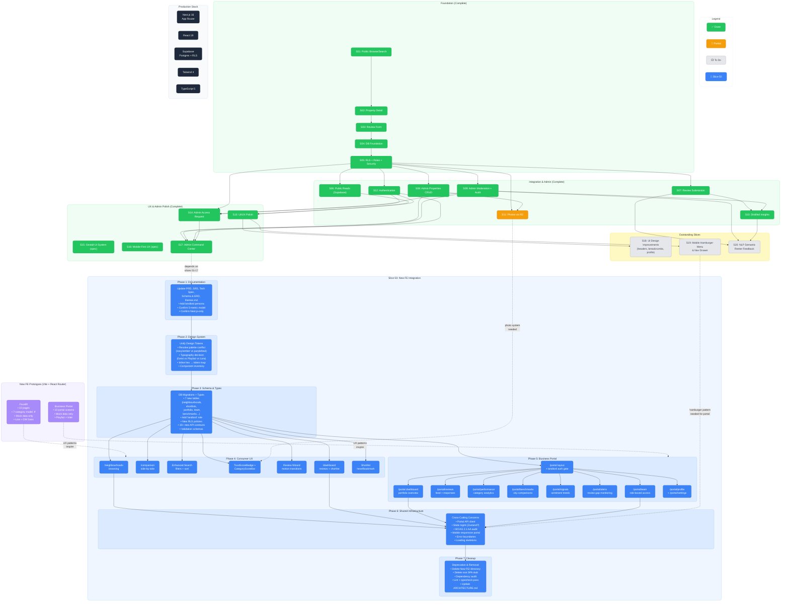

> **Companion Document** — Slice 50 dependency graph and project status visualization.
> **Related**: `slices/50-slice-new-fe-integration-plan.md` (integration plan), `proj_docs/obstaclesV2.md` (obstacles).

